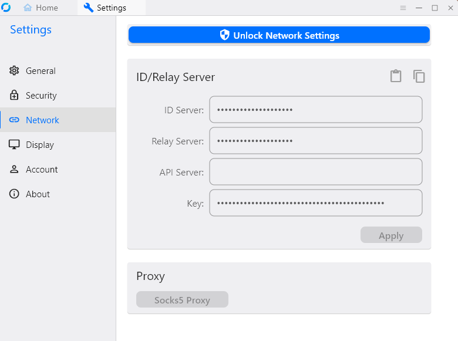

## Setting Up RustDesk for Remote Access Using Ansible

### [RU documentation](README_RU.md)

### Quick Start
1.Clone the repository to your local machine, for example in **HOME/YOUR_USER/ansible-project/**

```git clone git@github.com:quoterbox/wireguard-via-ansible-playbook.git ansible-project```

2.Specify the IP address of your server in the **hosts.ini** IP file under the **[www]**:  
```
[local]
localhost ansible_connection=local

[www]
111.111.111.111
```
3.Set the minimum required settings in the **group_vars/main.yml** file:
```
# Username on the computer from which you are configuring the remote server
localhost_user: yourLocalUser

# Any name, will be used only for SSH key identification
server_name: YourAnyNameForServer

# Domain or IP address of the remote server (the same as in hosts.ini)
remote_host: "111.111.111.111"
``` 

4.Create SSH key files on your local computer by running the first local playbook from the playbook folder
**HOME/YOUR_USER/ansible-project/**:

```ansible-playbook -i hosts.ini localhost_playbook.yml --ask-become-pass```

5.If the keys are successfully created, they will appear by default in the `~/.ssh/` folder

6.Copy the public key to the remote server, replacing the IP address in the command with your server's IP address:

```ssh-copy-id -i ~/.ssh/root_wg_server root@111.111.111.111```

In this command, `~/.ssh/root_wg_server` is used if you kept the default settings

7.Enter the root user password when prompted in the terminal to confirm the copying of the SSH keys
8.To verify that the keys have been successfully copied, try logging into the server without a password using the command:

```ssh root@111.111.111.111```

9.Install the rustdesk role from Ansible Galaxy:

```ansible-galaxy role install roles-ansible.rustdesk```

10.Run the main playbook to configure RustDesk on your server:

```ansible-playbook -i hosts.ini playbook.yml```

11.Copy from the console to the application on both devices: the one you are accessing from and the one you are accessing.

- ID Server
- Relay Server
- Key



## Possible Issues

1. Ensure that Python is installed:

```python --version```

or

```python3 --version```

2. Install Ansible on the computer from which you are configuring the remote server:

```sudo apt install ansible```

3. Verify that Ansible is installed:

```ansible --version```

4. Check that the server IP address is specified in `hosts.ini` and `group_vars/main.yml`

5. Ensure that you copied the **Key** correctly without newline characters `\n`
6. If connection fails, try using the server's IP address instead of the domain.

### RustDesk's documentation 

https://rustdesk.com/docs/en/self-host/

### Repository with the used role roles-ansible.rustdesk
https://github.com/roles-ansible/ansible_role_rustdesk

RustDesk role in Ansible Galaxy
https://galaxy.ansible.com/ui/standalone/roles/roles-ansible/rustdesk/

### LICENSE

[MIT License](./LICENSE.md) 

### Author
[JQ/Quoterbox](https://github.com/quoterbox)
