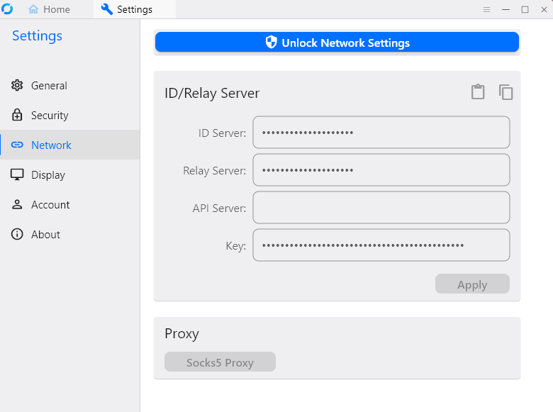

## Настройка RustDesk для удаленного доступа с помощью Ansible

### [EN documentation](README.md)

### Быстрый старт
1.Склонируйте себе репозиторий, например, в **HOME/ВАШ_ПОЛЬЗОВАТЕЛЬ/ansible-project/**

```git clone git@github.com:quoterbox/rustdesk-ansible-playbook.git ansible-project```

2.Укажите в файле **hosts.ini** IP адрес своего сервера в блоке **[www]**:  
```
[local]
localhost ansible_connection=local

[www]
111.111.111.111
```
3.Задайте минимально необходимые настройки в файле **group_vars/main.yml**:
```
# Имя пользователя на компьютере, с которого производится настройка удаленного сервера
localhost_user: yourLocalUser

# Любое имя, будет использоваться только для идентификации SSH ключей
server_name: YourAnyNameForServer

# Домен или IP адрес удаленного сервера (тот же что и в hosts.ini)
remote_host: "111.111.111.111"
``` 

7.Создаем на локальном компьютере файлы SSH ключей, запуская первый локальный плейбук из папки с плейбуками 
**HOME/ВАШ_ПОЛЬЗОВАТЕЛЬ/ansible-project/**:

```ansible-playbook -i hosts.ini localhost_playbook.yml```

8.Если ключи успешно созданы, то они появятся по умолчанию в папке `~/.ssh/`

9.Копируем публичный ключ на удаленный сервер, не забывая заменить IP адрес в команде на IP своего сервера:

```ssh-copy-id -i ~/.ssh/root_rustdesk_server root@111.111.111.111```

В данной команде `~/.ssh/root_rustdesk_server` - если вы оставили настройки по умолчанию

10.Вводим пароль от root пользователя при запросе в терминале, чтобы подтвердить копирование SSH ключей
11.Чтобы проверить, что ключи успешно скопированы, пробуем зайти на сервер без пароля с помощью команды:

```ssh root@111.111.111.111```

12.Установите роль rustdesk из Ansible Galaxy:

```ansible-galaxy role install roles-ansible.rustdesk```

12.Запустите основной плейбук для настройки RustDesk на вашем сервере:

```ansible-playbook -i hosts.ini playbook.yml```

13.Скопируйте из консоли в приложение на оба устройства: с которого получаете доступ и к которому получаете доступ.

- ID Server
- Relay Server
- Key



## Откат внесенных изменений
Вы можете откатить все изменения на сервере и локальной машине с помощью плейбуков в директории `rollback/`. 

1. Чтобы откатить изменения на сервере, запустите этот плейбук:

```ansible-playbook -i hosts.ini rollback/playbook.yml```

2. Чтобы откатить изменения на локальной машине (с которой идет настройка удаленного сервера), запустите этот плейбук:

```ansible-playbook -i hosts.ini rollback/localhost_playbook.yml```

## Возможные проблемы

1. Убедитесь, что у вас установлен Python:

```python --version```

или

```python3 --version```

2. Установите Ansible на компьютер, с которого производится настройка удаленного сервера:

```sudo apt install ansible```

3. Убедитесь, что Ansilbe установлен:

```ansible --version```

4. Проверьте, что все IP адрес сервера указан в `hosts.ini` и `group_vars/main.yml`

5. Убедитесь, что вы верно скопировали ключ **Key** без символов переноса строки `\n`
6. Если подключиться не удается, попробуйте указать вместо домена просто IP адрес своего сервера.
7. Если подключиться не удается, попробуйте использовать Relay Server connection в самом приложении RustDesk.

### Официальная документация RustDesk

https://rustdesk.com/docs/en/self-host/

### Репозиторий с используемой ролью roles-ansible.rustdesk
https://github.com/roles-ansible/ansible_role_rustdesk

RustDesk роль в Ansible Galaxy
https://galaxy.ansible.com/ui/standalone/roles/roles-ansible/rustdesk/

### LICENSE

[MIT License](./LICENSE.md) 

### Author
[JQ/Quoterbox](https://github.com/quoterbox)
